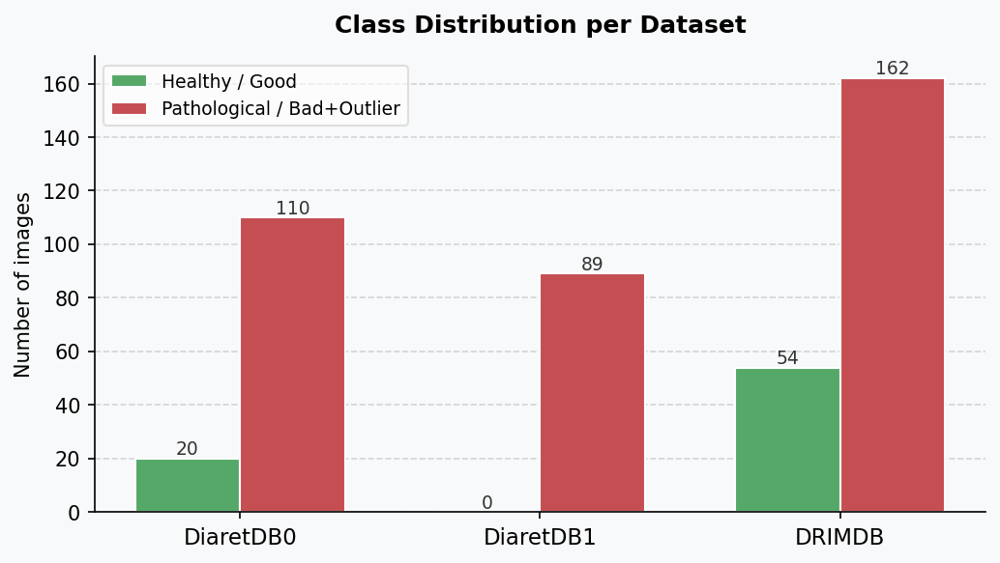
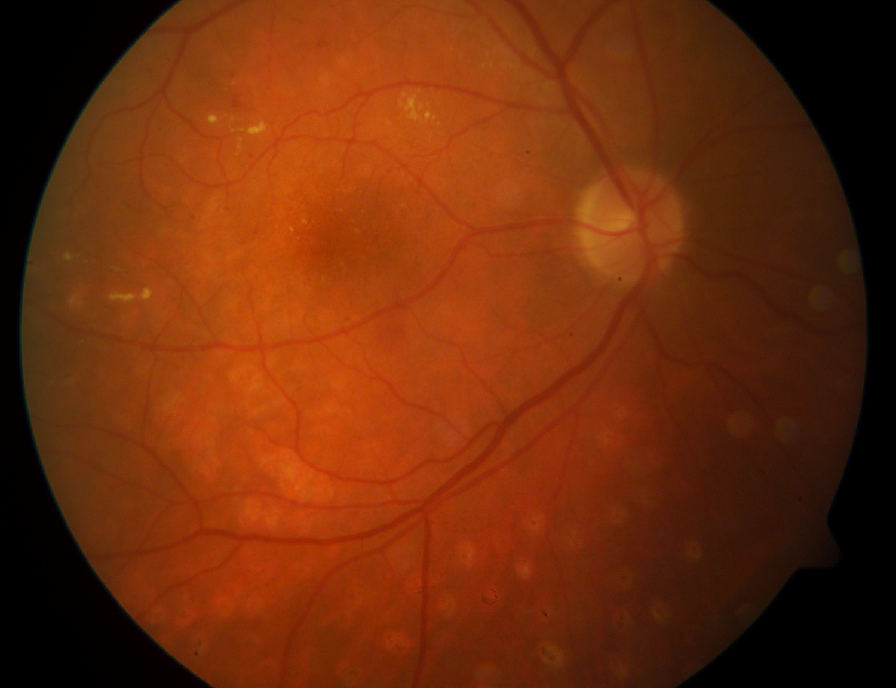
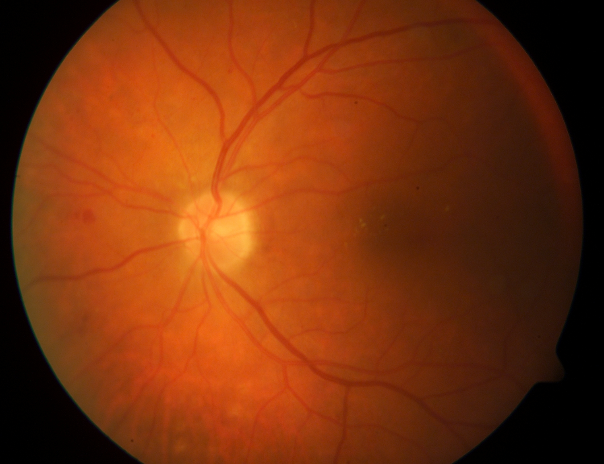
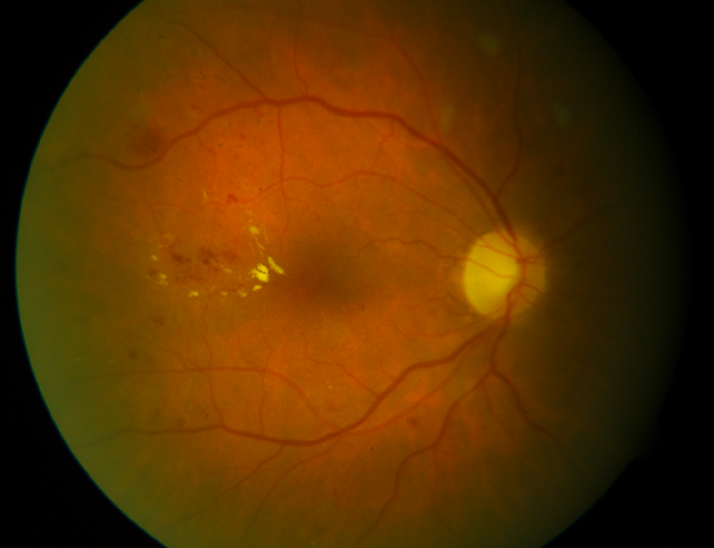
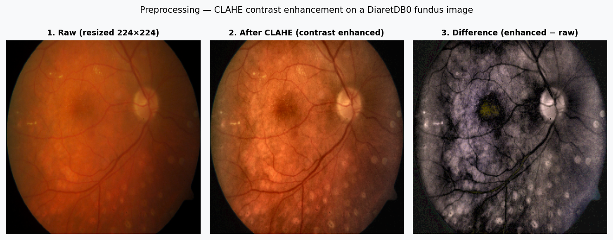
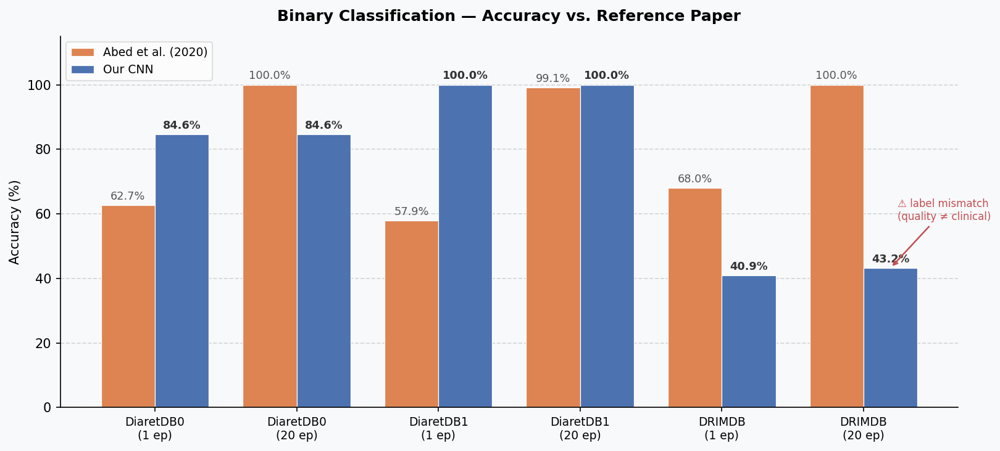
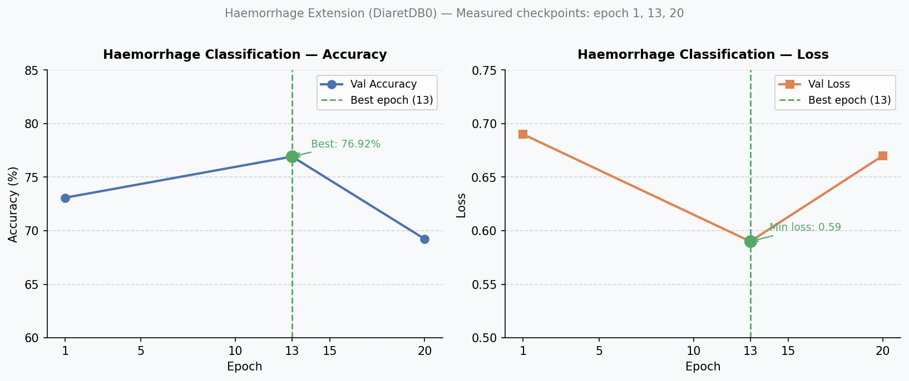

# CNN-retinopathy — Diabetic Retinopathy Detection

**Project 5 — AI Based Image Processing | ING3 IA A, Group 6 | CY Tech**
Bezet Camille · Brasa Franklin · Kenmogne Loïc · Martins Soares Flavio
*3 December 2025 — submitted to M. Djahid ABDELMOUMENE and Pr. Mai khuong NGUYEN VERGER*

---

## Context

Diabetic Retinopathy (DR) is one of the leading causes of blindness among the working-age population, affecting ~40% of the 425 million diabetics worldwide. Early diagnosis at the Non-Proliferative stage (NPDR) is essential to prevent irreversible vision loss.

> See **Report § Introduction** and **Slides 2–3** for the full medical context.

---

## Objective

Faithfully reproduce and evaluate the CNN architecture proposed by **Abed et al. (2020)** for binary classification of fundus images (healthy / pathological), then explore extensions.

---

## Data

| Dataset   | Images | Resolution   | Labels                                |
|-----------|--------|--------------|---------------------------------------|
| DiaretDB0 | 130    | 1500×1152 px | Annotated lesions (MA, haemorrhages…) |
| DiaretDB1 | 89     | 1500×1152 px | All pathological                      |
| DRIMDB    | 216    | 570×760 px   | Image quality (good / bad / outlier)  |

Only **DiaretDB0** is included in this repository (`Datasets/DiaretDB0/`).

### Class distribution



> The severe imbalance in DiaretDB0 (110 pathological vs 20 healthy) and the absence of healthy images in DiaretDB1 are the root cause of the majority-class bias discussed in the Results section.

### Sample fundus images (DiaretDB0)

<table>
  <tr>
    <td style="text-align:center"><br/><sub>image001 — pathological</sub></td>
    <td style="text-align:center"><br/><sub>image002 — pathological</sub></td>
    <td style="text-align:center"><br/><sub>image003 — pathological</sub></td>
  </tr>
</table>

---

## Preprocessing Pipeline

Implemented in [`CNN_Binaire-sain-pas-sain.ipynb`](CNN_Binaire-sain-pas-sain.ipynb):

1. **Loading & Conversion** — BGR → RGB
2. **Cropping** — remove dark borders (`crop_image_from_gray`, threshold tol=7)
3. **Resizing** — 224×224 px
4. **CLAHE** — contrast enhancement on the L channel (LAB colour space)
5. **Normalisation** — pixel values scaled to [0, 1]

### CLAHE effect on a fundus image



> Left: raw image after resizing. Centre: after CLAHE enhancement — blood vessels and lesions are more visible. Right: pixel-level difference highlighting which regions were enhanced.

---

## CNN Architecture

```
Input (224, 224, 3)
  → Conv Block 1 : Conv(8, 3×3) + BatchNorm + ReLU + MaxPool(2×2)
  → Conv Block 2 : Conv(16, 3×3) + BatchNorm + ReLU + MaxPool(2×2)
  → Conv Block 3 : Conv(32, 3×3) + BatchNorm + ReLU + MaxPool(2×2)
  → Flatten
  → Dense(64, ReLU) + Dropout(0.3)
  → Dense(2, Softmax)
Optimizer : SGD (lr=0.01, momentum=0.9) | Loss : Categorical Crossentropy
```

---

## Results — Healthy / Pathological Classification

80/20 train-test split, 20 epochs, evaluated across all 3 datasets.



> ⚠ **Critical interpretation:** High accuracy on DiaretDB0 (84.6%) and DiaretDB1 (100%) reflects **majority-class bias** — the model learns to predict "Pathological" for every input. The 100% on DB1 is trivial since all 89 images are pathological. The failure on DRIMDB (43.2%) reveals a methodological inconsistency in the original paper: DRIMDB labels image *quality* (good/bad/outlier), not clinical DR status.

### Per-dataset breakdown

<details>
<summary><b>DiaretDB0 — detail</b></summary>
<br/>

| Epochs | Abed et al. (2020) | Our CNN  |
|--------|--------------------|----------|
| 1      | 62.67%             | **84.6%**|
| 20     | 100%               | 84.62%   |

- Our model exceeds the paper's 1-epoch baseline but plateaus at 84.6%, matching the proportion of pathological images (110/130 ≈ 84.6%).
- Stable accuracy across epochs confirms the model is not learning — it is predicting the majority class.

</details>

<details>
<summary><b>DiaretDB1 — detail</b></summary>
<br/>

| Epochs | Abed et al. (2020) | Our CNN |
|--------|--------------------|---------|
| 1      | 57.9%              | **100%**|
| 20     | 99.1%              | 100%    |

- All 89 images in DiaretDB1 are pathological. A constant "Pathological" predictor achieves 100% trivially.
- This is the clearest example of majority-class bias in the project.

</details>

<details>
<summary><b>DRIMDB — detail</b></summary>
<br/>

| Epochs | Abed et al. (2020) | Our CNN |
|--------|--------------------|---------|
| 1      | 68%                | 40.91%  |
| 20     | 100%               | 43.2%   |

- DRIMDB uses image-quality labels, not clinical DR labels. Our model cannot generalise here.
- The paper's 100% on DRIMDB is implausible and suggests data leakage or label inconsistency in the original study.

</details>

---

## Extension — Classification by "Haemorrhage" Label

To circumvent the class bias, the problem is reformulated as **binary haemorrhage detection** on DiaretDB0 (29 images with haemorrhages / 101 without), using an enhanced preprocessing pipeline with retina boundary extraction.

Notebook: [`Classification selon le label "hémorragies".ipynb`](Classification%20selon%20le%20label%20%22h%C3%A9morragies%22.ipynb)

### Architecture changes for the extension

```
Input (224, 224, 3)
  → Conv Block 1 : Conv(8, 3×3) + BatchNorm + ReLU + MaxPool(2×2)
  → Conv Block 2 : Conv(16, 3×3) + BatchNorm + ReLU + MaxPool(2×2)
  → Flatten
  → Dense(2, ReLU) + Dropout(0.3)
  → Dense(1, Sigmoid)
Optimizer : Adam (lr=0.0001) | Loss : Binary Crossentropy
Split : 60% train / 20% val / 20% test
```

### Training curves



> Only checkpoints at epochs 1, 13, and 20 were recorded. Points connected for readability.

<details>
<summary><b>Haemorrhage — results by epoch</b></summary>
<br/>

| Epoch  | Accuracy   | Loss | Interpretation                     |
|--------|------------|------|------------------------------------|
| 1      | 73.08%     | 0.69 | Model starting to learn            |
| **13** | **76.92%** | **0.59** | **Optimum — best generalisation** |
| 20     | 69.23%     | 0.67 | Overfitting — performance degrades |

- The model peaks at epoch 13 then overfits on this small dataset (130 images).
- Early stopping at epoch 13 would be the recommended strategy.
- 76.92% accuracy is meaningful here because the classes are not trivially imbalanced.

</details>

---

## Technical Environment

| Component   | Detail                                      |
|-------------|---------------------------------------------|
| Language    | Python 3                                    |
| Framework   | TensorFlow / Keras                          |
| Environment | Jupyter Notebook / Google Colab (GPU)       |
| Libraries   | OpenCV, scikit-learn, matplotlib, numpy     |

---

## Conclusion

This project validates the technical soundness of the Abed et al. CNN, but more importantly exposes the **vulnerability of models to statistical biases** in small, imbalanced medical datasets. The haemorrhage extension demonstrates that reformulating the problem with balanced, meaningful labels leads to interpretable results. Data quality and rigorous problem formulation matter as much as the architecture itself.

---

## Main Reference

> M.H. Abed, L.A.N. Muhammed, S.H. Toman, *Diabetic Retinopathy Diagnosis based on Convolutional Neural Network*, arXiv:2008.00148, 2020.
